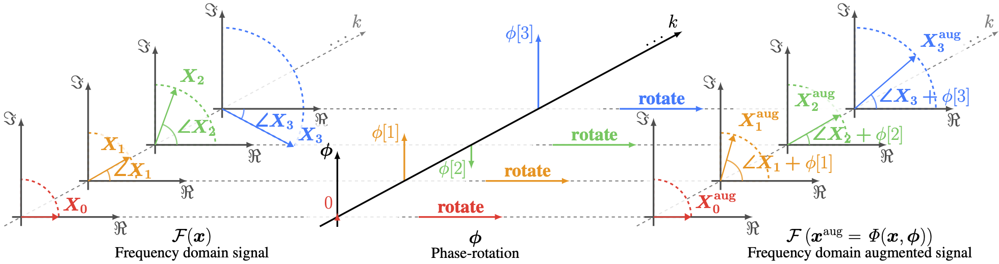

# PhaseAug

**PhaseAug: A Differentiable Augmentation for Speech Synthesis to Simulate One-to-Many Mapping**<br>
Junhyeok Lee, Seungu Han, Hyunjae Cho, Wonbin Jung @ [MINDsLab Inc.](https://github.com/mindslab-ai), SNU, KAIST

[](https://arxiv.org/abs/2211.04610) [](https://github.com/mindslab-ai/phaseaug) [](https://mindslab-ai.github.io/phaseaug/)


**Abstract** : Previous generative adversarial network (GAN)-based neural vocoders are trained to reconstruct the exact ground truth waveform from the paired mel-spectrogram and do not consider the one-to-many relationship of speech synthesis. This conventional training causes overfitting for both the discriminators and the generator, leading to the periodicity artifacts in the generated audio signal. In this work, we present PhaseAug, the first differentiable augmentation for speech synthesis that rotates the phase of each frequency bin to simulate one-to-many mapping. With our proposed method, we outperform baselines without any architecture modification. Code and audio samples will be available at https://github.com/mindslab-ai/phaseaug.

Submitted to ICASSP 2023

 


## TODO
- Errata in paper will be fixed. Section 2.5 in paper, transition band half-width 0.06-> 0.012
- Section 2.5, mention about multiplyinng rotation matrix to "the left side of F(x)" will be added.
- We will uplade PhaseAug to [pypi](https://pypi.org).

## Use PhaseAug
- Install `alias-free-torch==0.0.6` and `phaseaug`
```bash
pip install alias-free-torch==0.0.6 phaseaug 
```
- Insert PhaseAug in your code, check [train.py](./train.py) as a example.
```python
from phaseaug import PhaseAug
...
# define phaseaug
aug = PhaseAug()
...
#discriminator update phase
aug_y, aug_y_g = aug.forward_sync(y, y_g_hat.detach())
y_df_hat_r, y_df_hat_g, _, _ = mpd(aug_y, aug_y_g)
y_ds_hat_r, y_ds_hat_g, _, _ = msd(aug_y, aug_y_g)
...
#generator update phase
aug_y, aug_y_g = aug.forward_sync(y, y_g_hat)
y_df_hat_r, y_df_hat_g, fmap_f_r, fmap_f_g = mpd(
                        aug_y, aug_y_g)
y_ds_hat_r, y_ds_hat_g, fmap_s_r, fmap_s_g = msd(
                        aug_y, aug_y_g)
```

## Requirements
- [Pytorch>=1.7.0](https://pytorch.org/) for [alias-free-torch](https://github.com/junjun3518/alias-free-torch)
- The requirements are highlighted in [requirements.txt](./requirements.txt).
- We also provide docker setup [Dockerfile](./Dockerfile).
```
docker build -t=phaseaug --build-arg USER_ID=$(id -u) --build-arg GROUP_ID=$(id -g) --build-arg USER_NAME=$USER
```
- Cloned [official HiFi-GAN repo](https://github.com/jik876/hifi-gan).
- Downloaded [LJ Speech Dataset](https://keithito.com/LJ-Speech-Dataset/).
- (optional) [MelGAN](https://github.com/descriptinc/melgan-neurips) generator

## Training
0. Clone this repository and copy python files to hifi-gan folder
```bash
git clone --recursive https://github.com/mindslab-ai/phaseaug
cp ./phaseaug/*.py ./phaseaug/hifi-gan/
cd ./phaseaug/hifi-gan
```

  - optional: MelGAN generator
  ```bash
  cp ./phaseaug/config_v1_melgan.json ./phaseaug/hifi-gan/
  ```
  - Change generator to MelGAN generator at train.py
  ```python
  # import MelGanGenerator as Generator at [train.py](./train.py)
  #from models import Generator # remove original import Generator
  from models import MelGANGenerator as Generator
  ```

1. Modify dataset path at `train.py`
```python
     parser.add_argument('--input_wavs_dir',
                         default='path/LJSpeech-1.1/wavs_22k')
     parser.add_argument('--input_mels_dir',
                         default='path/LJSpeech-1.1/wavs_22k')
```

2. Run train.py
```
python train.py --config config_v1.json --aug --filter --data_ratio {0.01/0.1/1.} --name phaseaug_hifigan
```
```
python train.py --config config_v1_melgan.json --aug --filter --data_ratio {0.01/0.1/1.} --name phaseaug_melgan
```


## References
This implementation uses code from following repositories:
- [Official HiFi-GAN implementation](https://github.com/jik876/hifi-gan)
- [Official MelGAN implementation](https://github.com/descriptinc/melgan-neurips)
- [Official CARGAN implementation](https://github.com/descriptinc/cargan)
- [alias-free-torch](https://github.com/junjun3518/alias-free-torch)

This README and the webpage for the audio samples are inspired by:
- [LJ Speech Dataset](https://keithito.com/LJ-Speech-Dataset/)
- [Official HiFi-GAN implementation](https://github.com/jik876/hifi-gan)

## Citation & Contact

If this repostory useful for yout research, please consider citing!
```bib
@inproceedings{phaseaug,
  author={Lee, Junhyeok and Han, Seungu and Cho, Hyunjae and Jung, Wonbin},
  title={{PhaseAug: A Differentiable Augmentation for Speech Synthesis to Simulate One-to-Many Mapping}},
  journal = {arXiv preprint arXiv:2211.04610},
  year=2022,
}
```
If you have a question or any kind of inquiries, please contact Junhyeok Lee at [jun3518@mindslab.ai](mailto:jun3518@mindslab.ai)

